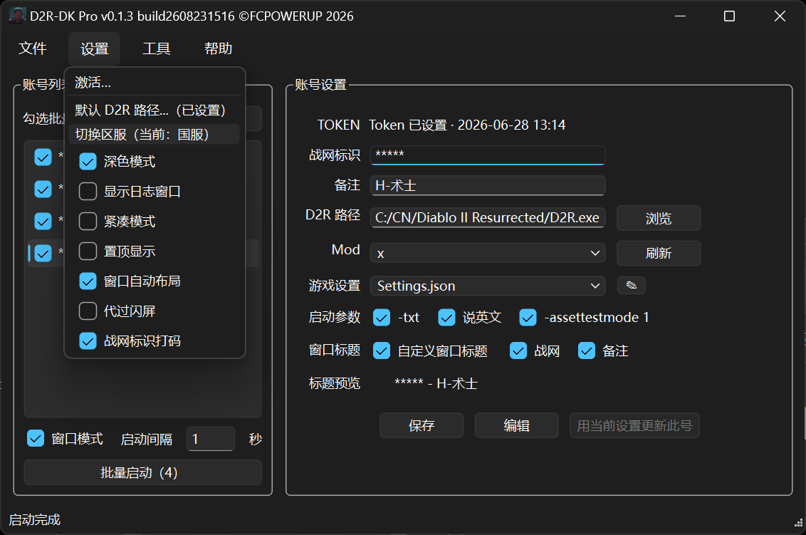
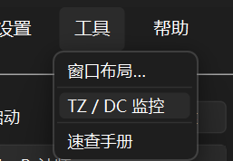

# 暗黑破坏神2：重制版 · 多开器（D2R-DK）

本仓库是 **[FCPOWERUP](https://github.com/fcpowerup)** 的《**暗黑破坏神 II：重制版**》多开器项目。

可同时启动多个客户端账号，支持国服与国际服，每号独立画质 / 窗口 / 位置。

## 本次更新（v0.1.3）

- 新增国际服多开：设置里切换区服，账号与窗口布局档位两边独立保存
- 批量启动升级：勾选 2 个及以上显示「批量启动（N）」；批量进行中可点「停止」，已开窗口和勾选保持不变
- 右键账号「单独启动」：不必先勾选即可单开该号
- 防顶号：本程序已打开的账号再启动会自动跳过
- 窗口布局：国服 / 国际服各一组 9 槽，切换区服时布局窗口自动关闭，标题显示当前区服
- 界面语言可选简体中文 / 英文；账号列表支持排序
- 工具菜单新增「[速查手册](https://fcpowerup.github.io/d2r-cheat-sheet-zh/)」，游戏资料在线速查

<p align="center">
  
  
</p>
<p align="center"><sub>左：设置 → 切换区服 · 右：工具 → 速查手册</sub></p>

## 下载

请到本仓库 **[Releases](https://github.com/fcpowerup/D2R-DK/releases)** 下载最新版：

- `D2R-DK_v0.1.3_build2608231516_p.exe`
- 同目录哈希文件 `D2R-DK_v0.1.3_build2608231516_p.txt`（可用 SHA256 自检）

当前版本：**0.1.3** · build **`2608231516_p`** · 国服 / 国际服批量多开。

**SHA256**

```text
CA1C206BB1BC165E5AC5E1E928490295FD98ABEB63F2CAD41FCE331F01391296
```

## 食用指南

图文说明（含截图）：

https://fcpowerup.github.io/D2R-DK/

## 运行环境

- Windows 10 / 11，64 位
- 本机已安装并可正常启动《暗黑破坏神 II：重制版》国服或国际服客户端
- 多数机器已有 VC++ 2015–2022 x64；若提示缺少 `VCRUNTIME140.dll`，安装该运行库即可
- **不需要**安装 Python / .NET / Node

把 exe 放到固定目录双击运行。同目录下的 `D2R-DK.json` / `D2R-DK.lock.json` / `D2R-DK.ini` 会在首次运行后自动生成，**请勿手动删除**。

## 注意

第三方辅助软件，使用风险自负。主密码无法找回。勿把 Token、导出包与导出包密码发给他人或上传未加密网盘。
