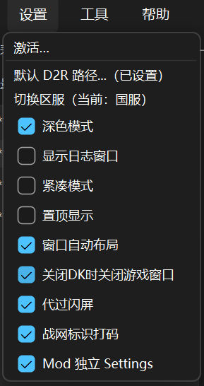
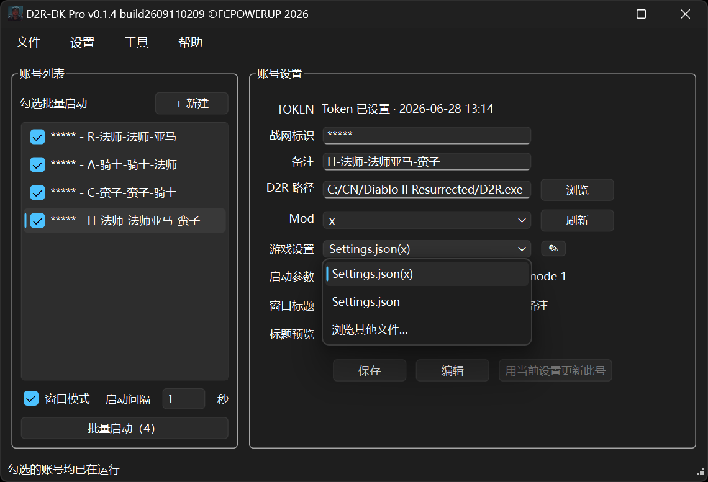

# 暗黑破坏神2：重制版 · 多开器（D2R-DK）

本仓库是 **[FCPOWERUP](https://github.com/fcpowerup)** 的《**暗黑破坏神 II：重制版**》多开器项目。

可同时启动多个客户端账号，支持国服与国际服，每号独立画质 / 窗口 / 位置。

## 本次更新（v0.1.4）

- 同一账号的不同 Mod 各存一份游戏设置，切换 Mod 自动切换
- 账号列表右键「关闭所有游戏」：关掉当前区服里由本工具打开的游戏窗口
- 设置「关闭DK时关闭游戏窗口」：点主窗 × 时同时关掉这些游戏窗口；从托盘退出则不关
- 获取 Token 改为打开系统默认浏览器

<p align="center">
  
  
</p>
<p align="center"><sub>左：设置 → Mod 独立 Settings · 右：游戏设置按当前 Mod 分开</sub></p>

## 下载

请到本仓库 **[Releases](https://github.com/fcpowerup/D2R-DK/releases)** 下载最新版：

- `D2R-DK_v0.1.4_build2609110209_p.exe`
- 同目录哈希文件 `D2R-DK_v0.1.4_build2609110209_p.txt`（可用 SHA256 自检）

当前版本：**0.1.4** · build **`2609110209_p`** · 国服 / 国际服批量多开。

**SHA256**

```text
F41617BF22B6B898E5B219EF375F19C77430125300D4975887CC84270F3AF71B
```

## 食用指南

图文说明（含截图）：

https://fcpowerup.github.io/D2R-DK/

## 运行环境

- Windows 10 / 11，64 位
- 本机已安装并可正常启动《暗黑破坏神 II：重制版》国服或国际服客户端
- 多数机器已有 VC++ 2015–2022 x64；若提示缺少 `VCRUNTIME140.dll`，安装该运行库即可
- **不需要**安装 Python / .NET / Node

把 exe 放到固定目录双击运行。同目录下的 `D2R-DK.json` / `D2R-DK.lock.json` / `D2R-DK.ini` 会在首次运行后自动生成，**请勿手动删除**。

## 注意

第三方辅助软件，使用风险自负。主密码无法找回。勿把 Token、导出包与导出包密码发给他人或上传未加密网盘。
